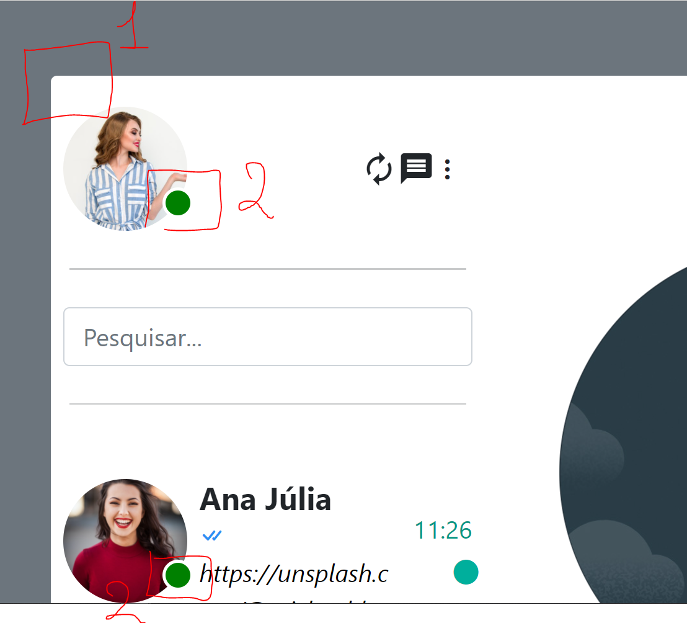

# Template for Whatsapp

### Descrição:
Foi uma ideia de uma conversa sobre templates de Whatsapp.
 

## Idéia

Na imagem abaixo tem 2 marcações sobre o que deveria fazer para o template do Whatsapp

O Numero 1 é sobre ter bordas mais arredondadas.

O numero 2 é sobre ter o status:
  * A) Do próprio usuário afim de saber se Voce esta visível para os outros.
  * B) O status compartilhado do seu própio contato.

  

## Links
​
Links das Imagens Gratuitas no https://unsplash.com/

[Danrley Alves - Fotografia](https://unsplash.com/@danrley_alves)

​
[Michael Dam](https://unsplash.com/@michaeldam)
​
[Tamara Bellis](https://unsplash.com/@tamarabellis)
​

​